# 🛰️ iTantra — Complete Architectural Flow & Pipeline Diagram

> **Indian Multilingual TTS & STT Aided Neural Transceiver Radio Access for Low-Bitrate Links**
> SIH 26173 (ISRO) — Flutter/Dart Cross-Platform Application

---

## 1. System-Level Architecture Overview

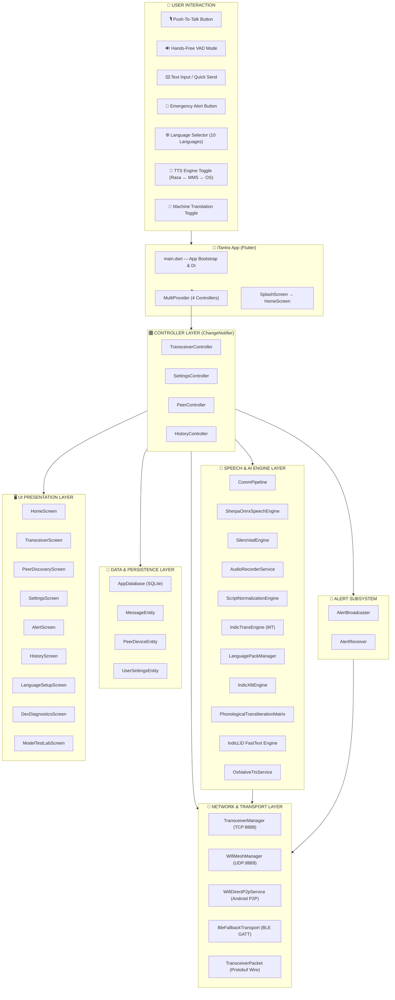
```mermaid
graph TB
    subgraph USER["👤 USER INTERACTION"]
        PTT["🎙️ Push-To-Talk Button"]
        VAD_BTN["🔊 Hands-Free VAD Mode"]
        TEXT_INPUT["⌨️ Text Input / Quick Send"]
        ALERT_BTN["🚨 Emergency Alert Button"]
        LANG_SELECT["🌐 Language Selector (10 Languages)"]
        TTS_TOGGLE["🔄 TTS Engine Toggle (Rasa ↔ MMS ↔ OS)"]
        MT_TOGGLE["🔄 Machine Translation Toggle"]
    end

    subgraph APP["📱 iTantra App (Flutter)"]
        MAIN["main.dart — App Bootstrap & DI"]
        PROVIDERS["MultiProvider (4 Controllers)"]
        SPLASH["SplashScreen → HomeScreen"]
    end

    subgraph CONTROLLERS["🎛️ CONTROLLER LAYER (ChangeNotifier)"]
        TC["TransceiverController"]
        SC["SettingsController"]
        PC["PeerController"]
        HC["HistoryController"]
    end

    subgraph SPEECH["🧠 SPEECH & AI ENGINE LAYER"]
        CP["CommPipeline"]
        SE["SherpaOnnxSpeechEngine"]
        VAD["SileroVadEngine"]
        AR["AudioRecorderService"]
        SNE["ScriptNormalizationEngine"]
        ITE["IndicTransEngine (MT)"]
        LPM["LanguagePackManager"]
        XLIT["IndicXlitEngine"]
        PTM["PhonologicalTransliterationMatrix"]
        LID["IndicLID FastText Engine"]
        OS_TTS["OsNativeTtsService"]
    end

    subgraph NETWORK["📡 NETWORK & TRANSPORT LAYER"]
        TM["TransceiverManager (TCP:8888)"]
        WMM["WifiMeshManager (UDP:8889)"]
        P2P["WifiDirectP2pService (Android P2P)"]
        BLE["BleFallbackTransport (BLE GATT)"]
        PROTO["TransceiverPacket (Protobuf Wire)"]
    end

    subgraph ALERTS["🚨 ALERT SUBSYSTEM"]
        AB["AlertBroadcaster"]
        AREC["AlertReceiver"]
    end

    subgraph DATA["💾 DATA & PERSISTENCE LAYER"]
        DB["AppDatabase (SQLite)"]
        ME["MessageEntity"]
        PDE["PeerDeviceEntity"]
        USE["UserSettingsEntity"]
    end

    subgraph UI["🖥️ UI PRESENTATION LAYER"]
        HS["HomeScreen"]
        TS["TransceiverScreen"]
        PDS["PeerDiscoveryScreen"]
        SS["SettingsScreen"]
        AS["AlertScreen"]
        HIS["HistoryScreen"]
        LSS["LanguageSetupScreen"]
        DDS["DevDiagnosticsScreen"]
        MTLS["ModelTestLabScreen"]
    end

    USER --> APP
    APP --> PROVIDERS
    PROVIDERS --> CONTROLLERS
    CONTROLLERS --> SPEECH
    CONTROLLERS --> NETWORK
    CONTROLLERS --> ALERTS
    CONTROLLERS --> DATA
    CONTROLLERS --> UI
    SPEECH --> NETWORK
    ALERTS --> NETWORK
```

---

## 2. Application Bootstrap & Dependency Injection Pipeline

> **File:** [main.dart](file:///d:/My%20FIles/Softwares/iTantra/ITantra-dart/lib/main.dart)

```mermaid
flowchart TD
    START(["🚀 main()"]) --> ENSURE["WidgetsFlutterBinding.ensureInitialized()"]
    ENSURE --> DB_INIT["AppDatabase.instance\n(SQLite open / schema heal)"]
    
    DB_INIT --> ENGINE_INIT["Initialize Engines"]
    subgraph ENGINES_BOOT["Engine Instantiation"]
        LPM_BOOT["LanguagePackManager()"]
        SOE_BOOT["SherpaOnnxSpeechEngine(lpm)"]
        ITE_BOOT["IndicTransEngine(lpm)"]
        SVE_BOOT["SileroVadEngine()"]
        ARS_BOOT["AudioRecorderService()"]
        TM_BOOT["TransceiverManager()"]
        WMM_BOOT["WifiMeshManager(tm)"]
    end
    ENGINE_INIT --> ENGINES_BOOT

    ENGINES_BOOT --> CP_BOOT["CommPipeline(\n  audioRecorderService,\n  vadEngine,\n  speechEngine,\n  transceiverManager\n)"]
    
    CP_BOOT --> ALERTS_BOOT["AlertBroadcaster(tm) +\nAlertReceiver(tm, soe, db)"]
    
    ALERTS_BOOT --> PROVIDERS_BOOT["MultiProvider Setup"]
    subgraph CONTROLLERS_BOOT["Controllers Instantiation"]
        TC_INST["TransceiverController(\n  commPipeline, tm, wmm, db,\n  alertBroadcaster, alertReceiver,\n  speechEngine, indicTransEngine\n)"]
        SC_INST["SettingsController(db, lpm, soe)"]
        PC_INST["PeerController(wmm, tm)"]
        HC_INST["HistoryController(db)"]
    end
    PROVIDERS_BOOT --> CONTROLLERS_BOOT

    CONTROLLERS_BOOT --> RUN_APP["runApp(ITantraApp)"]
    RUN_APP --> THEME["MaterialApp (AppTheme.darkTheme)"]
    THEME --> SPLASH_PAGE["SplashScreen → HomeScreen"]
```

---

## 3. Core Communication Pipeline (CommPipeline)

> **File:** [comm_pipeline.dart](file:///d:/My%20FIles/Softwares/iTantra/ITantra-dart/lib/speech/comm_pipeline.dart)

The `CommPipeline` is the beating heart of iTantra. It coordinates audio capture, voice activity detection, speech recognition, packet construction, and network transmission.

### 3.1 Transmission Flow (Speech → Wire)

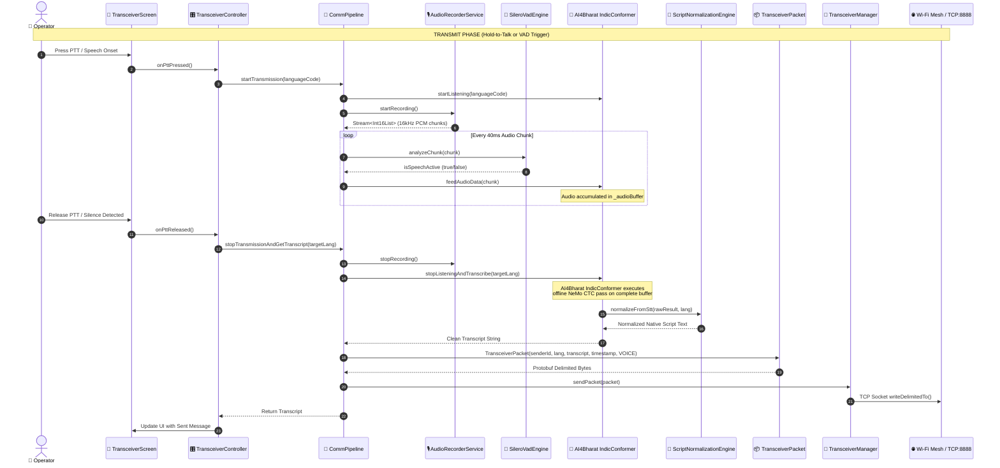
```mermaid
sequenceDiagram
    autonumber
    actor User as 👤 Operator
    participant UI as 📱 TransceiverScreen
    participant TC as 🎛️ TransceiverController
    participant CP as 🔄 CommPipeline
    participant REC as 🎙️ AudioRecorderService
    participant VAD as 🧠 SileroVadEngine
    participant STT as 🧠 AI4Bharat IndicConformer
    participant SNE as 📝 ScriptNormalizationEngine
    participant PKT as 📦 TransceiverPacket
    participant TM as 📡 TransceiverManager
    participant NET as 🌐 Wi-Fi Mesh / TCP:8888

    Note over User,NET: TRANSMIT PHASE (Hold-to-Talk or VAD Trigger)
    User->>UI: Press PTT / Speech Onset
    UI->>TC: onPttPressed()
    TC->>CP: startTransmission(languageCode)
    CP->>STT: startListening(languageCode)
    CP->>REC: startRecording()
    REC-->>CP: Stream<Int16List> (16kHz PCM chunks)

    loop Every 40ms Audio Chunk
        CP->>VAD: analyzeChunk(chunk)
        VAD-->>CP: isSpeechActive (true/false)
        CP->>STT: feedAudioData(chunk)
        Note over STT: Audio accumulated in _audioBuffer
    end

    User->>UI: Release PTT / Silence Detected
    UI->>TC: onPttReleased()
    TC->>CP: stopTransmissionAndGetTranscript(targetLang)
    CP->>REC: stopRecording()
    CP->>STT: stopListeningAndTranscribe(targetLang)
    Note over STT: AI4Bharat IndicConformer executes<br/>offline NeMo CTC pass on complete buffer
    STT->>SNE: normalizeFromStt(rawResult, lang)
    SNE-->>STT: Normalized Native Script Text
    STT-->>CP: Clean Transcript String
    CP->>PKT: TransceiverPacket(senderId, lang, transcript, timestamp, VOICE)
    PKT-->>CP: Protobuf Delimited Bytes
    CP->>TM: sendPacket(packet)
    TM->>NET: TCP Socket writeDelimitedTo()
    CP-->>TC: Return Transcript
    TC->>UI: Update UI with Sent Message
```

### 3.2 Reception Flow (Wire → Voice Output)

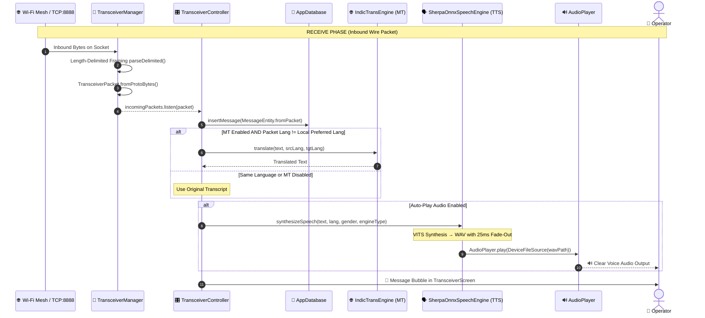
```mermaid
sequenceDiagram
    autonumber
    participant NET as 🌐 Wi-Fi Mesh / TCP:8888
    participant TM as 📡 TransceiverManager
    participant TC as 🎛️ TransceiverController
    participant DB as 💾 AppDatabase
    participant MT as 🌐 IndicTransEngine (MT)
    participant TTS as 🗣️ SherpaOnnxSpeechEngine (TTS)
    participant AUD as 🔊 AudioPlayer
    actor User as 👤 Operator

    Note over NET,User: RECEIVE PHASE (Inbound Wire Packet)
    NET->>TM: Inbound Bytes on Socket
    TM->>TM: Length-Delimited Framing parseDelimited()
    TM->>TM: TransceiverPacket.fromProtoBytes()
    TM-->>TC: incomingPackets.listen(packet)
    TC->>DB: insertMessage(MessageEntity.fromPacket)
    
    alt MT Enabled AND Packet Lang != Local Preferred Lang
        TC->>MT: translate(text, srcLang, tgtLang)
        MT-->>TC: Translated Text
    else Same Language or MT Disabled
        Note over TC: Use Original Transcript
    end

    alt Auto-Play Audio Enabled
        TC->>TTS: synthesizeSpeech(text, lang, gender, engineType)
        Note over TTS: VITS Synthesis → WAV with 25ms Fade-Out
        TTS->>AUD: AudioPlayer.play(DeviceFileSource(wavPath))
        AUD-->>User: 🔊 Clear Voice Audio Output
    end
    TC->>User: 📱 Message Bubble in TransceiverScreen
```

### 3.3 VAD Auto-Mode Pipeline (Hands-Free)

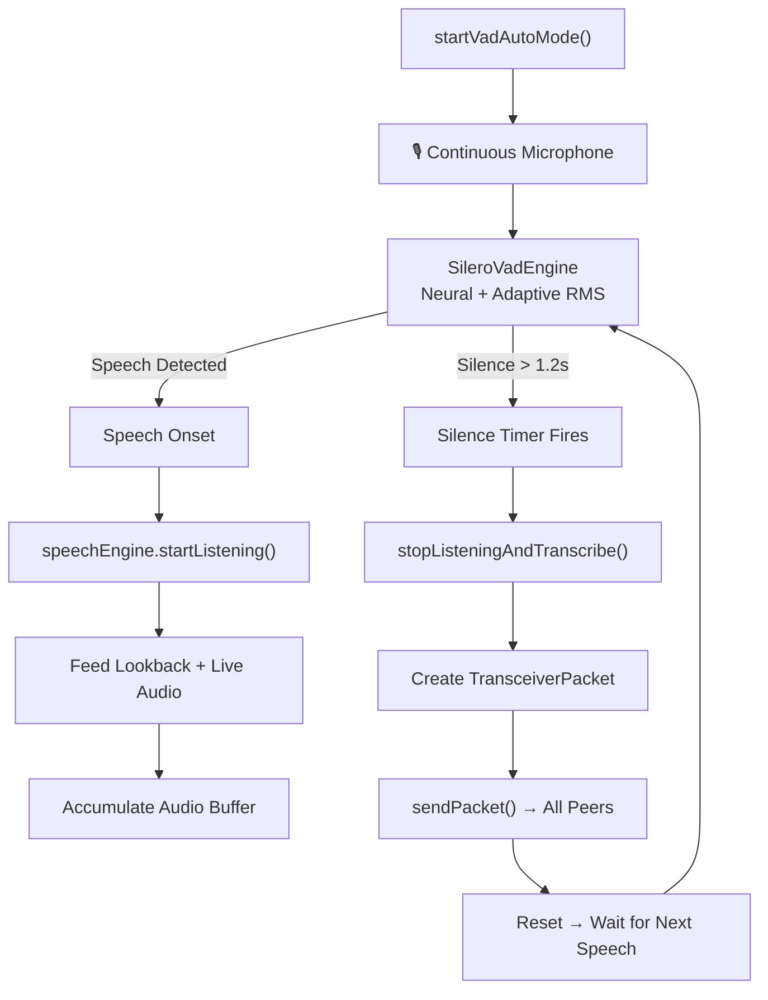
```mermaid
flowchart TD
    START_VAD["startVadAutoMode()"] --> MIC2["🎙️ Continuous Microphone"]
    MIC2 --> VAD2["SileroVadEngine\nNeural + Adaptive RMS"]
    VAD2 -- "Speech Detected" --> ONSET["Speech Onset"]
    ONSET --> START_STT["speechEngine.startListening()"]
    START_STT --> FEED["Feed Lookback + Live Audio"]
    FEED --> ACCUMULATE["Accumulate Audio Buffer"]
    VAD2 -- "Silence > 1.2s" --> END["Silence Timer Fires"]
    END --> STOP_STT["stopListeningAndTranscribe()"]
    STOP_STT --> PACKET2["Create TransceiverPacket"]
    PACKET2 --> SEND2["sendPacket() → All Peers"]
    SEND2 --> RESET["Reset → Wait for Next Speech"]
    RESET --> VAD2
```

### Working Parts — CommPipeline

| Component | File | Role |
|-----------|------|------|
| `AudioRecorderService` | [audio_recorder_service.dart](file:///d:/My%20FIles/Softwares/iTantra/ITantra-dart/lib/speech/audio_recorder_service.dart) | Captures 16kHz 16-bit mono PCM from device microphone via `record` package |
| `SileroVadEngine` | [silero_vad_engine.dart](file:///d:/My%20FIles/Softwares/iTantra/ITantra-dart/lib/speech/silero_vad_engine.dart) | Neural Silero VAD (ONNX) with adaptive RMS energy fallback; 200ms lookback ring buffer |
| `SherpaOnnxSpeechEngine` | [sherpa_onnx_speech_engine.dart](file:///d:/My%20FIles/Softwares/iTantra/ITantra-dart/lib/speech/sherpa_onnx_speech_engine.dart) | Dedicated STT (AI4Bharat IndicConformer) + Neural TTS (VITS Rasa-13 / MMS) via sherpa-onnx |
| `ScriptNormalizationEngine` | [script_normalization_engine.dart](file:///d:/My%20FIles/Softwares/iTantra/ITantra-dart/lib/speech/script_normalization_engine.dart) | Indic script normalization, Latin→Devanagari transliteration, Unicode cleanup |
| `TransceiverPacket` | [transceiver_packet.dart](file:///d:/My%20FIles/Softwares/iTantra/ITantra-dart/lib/proto/transceiver_packet.dart) | Binary Protobuf wire format (5 fields: senderId, langCode, transcript, timestampMs, type) |
| `TransceiverManager` | [transceiver_manager.dart](file:///d:/My%20FIles/Softwares/iTantra/ITantra-dart/lib/network/transceiver_manager.dart) | TCP socket server/client on port 8888 with length-delimited framing |

---

## 4. Speech & AI Engine Layer — Detailed Breakdown

### 4.1 STT Engine — Speech-to-Text

> **File:** [sherpa_onnx_speech_engine.dart](file:///d:/My%20FIles/Softwares/iTantra/ITantra-dart/lib/speech/sherpa_onnx_speech_engine.dart)

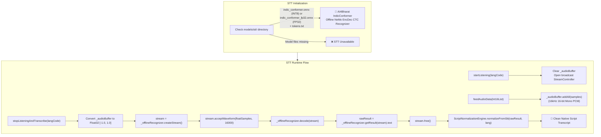
```mermaid
flowchart TD
    subgraph STT_INIT["STT Initialization"]
        CHECK_MODELS["Check models/stt/ directory"]
        CHECK_MODELS -- "indic_conformer.onnx (INT8) or\nindic_conformer_fp32.onnx (FP32)\n+ tokens.txt" --> INDIC["🧠 AI4Bharat IndicConformer\nOffline NeMo EncDec CTC Recognizer"]
        CHECK_MODELS -- "Model files missing" --> FAIL["❌ STT Unavailable"]
    end

    subgraph STT_RUNTIME["STT Runtime Flow"]
        LISTEN["startListening(langCode)"]
        LISTEN --> CLEAR["Clear _audioBuffer\nOpen broadcast StreamController"]
        
        FEED_AUDIO["feedAudioData(Int16List)"]
        FEED_AUDIO --> BUFFER["_audioBuffer.addAll(samples)\n(16kHz 16-bit Mono PCM)"]
        
        STOP["stopListeningAndTranscribe(langCode)"]
        STOP --> CONVERT["Convert _audioBuffer to Float32 [-1.0, 1.0]"]
        CONVERT --> CREATE_STREAM["stream = _offlineRecognizer.createStream()"]
        CREATE_STREAM --> ACCEPT["stream.acceptWaveform(floatSamples, 16000)"]
        ACCEPT --> DECODE["_offlineRecognizer.decode(stream)"]
        DECODE --> GET_RESULT["rawResult = _offlineRecognizer.getResult(stream).text"]
        GET_RESULT --> FREE_STREAM["stream.free()"]
        FREE_STREAM --> NORMALIZE_FINAL["ScriptNormalizationEngine.normalizeFromStt(rawResult, lang)"]
        NORMALIZE_FINAL --> FINAL_TEXT["📝 Clean Native Script Transcript"]
    end

    STT_INIT --> STT_RUNTIME
```

### 4.2 TTS Engine — Text-to-Speech

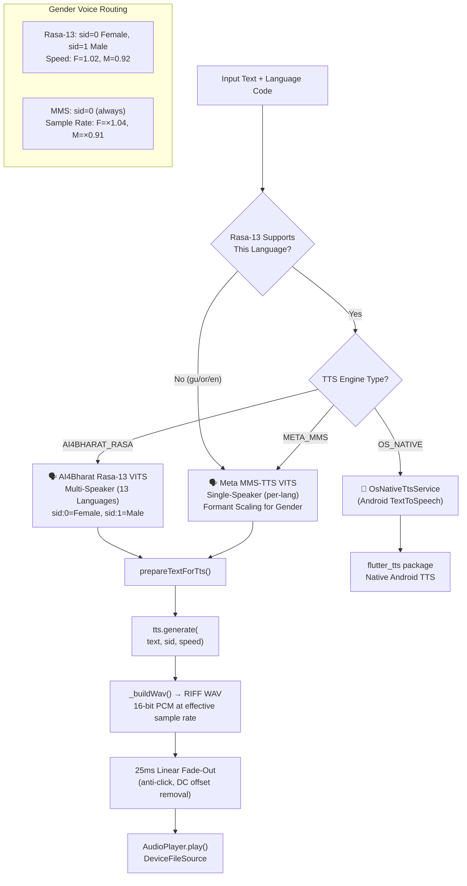
```mermaid
flowchart TD
    INPUT_TEXT["Input Text + Language Code"]
    INPUT_TEXT --> GUARD{"Rasa-13 Supports\nThis Language?"}
    GUARD -- "No (gu/or/en)" --> MMS["Meta MMS Fallback"]
    GUARD -- "Yes" --> ENGINE_SELECT{"TTS Engine Type?"}
    
    ENGINE_SELECT -- "AI4BHARAT_RASA" --> RASA["🗣️ AI4Bharat Rasa-13 VITS\nMulti-Speaker (13 Languages)\nsid:0=Female, sid:1=Male"]
    ENGINE_SELECT -- "META_MMS" --> MMS
    ENGINE_SELECT -- "OS_NATIVE" --> OS["📱 OsNativeTtsService\n(Android TextToSpeech)"]
    
    MMS["🗣️ Meta MMS-TTS VITS\nSingle-Speaker (per-lang)\nFormant Scaling for Gender"]
    
    RASA --> NORMALIZE_TTS["prepareTextForTts()"]
    MMS --> NORMALIZE_TTS
    NORMALIZE_TTS --> GENERATE["tts.generate(\ntext, sid, speed)"]
    GENERATE --> WAV_BUILD["_buildWav() → RIFF WAV\n16-bit PCM at effective sample rate"]
    WAV_BUILD --> FADE["25ms Linear Fade-Out\n(anti-click, DC offset removal)"]
    FADE --> PLAY["AudioPlayer.play()\nDeviceFileSource"]
    
    OS --> FLUTTER_TTS["flutter_tts package\nNative Android TTS"]

    subgraph GENDER["Gender Voice Routing"]
        RASA_GENDER["Rasa-13: sid=0 Female, sid=1 Male\nSpeed: F=1.02, M=0.92"]
        MMS_GENDER["MMS: sid=0 (always)\nSample Rate: F=×1.04, M=×0.91"]
    end
```

### 4.3 Voice Activity Detection (VAD)

> **File:** [silero_vad_engine.dart](file:///d:/My%20FIles/Softwares/iTantra/ITantra-dart/lib/speech/silero_vad_engine.dart)

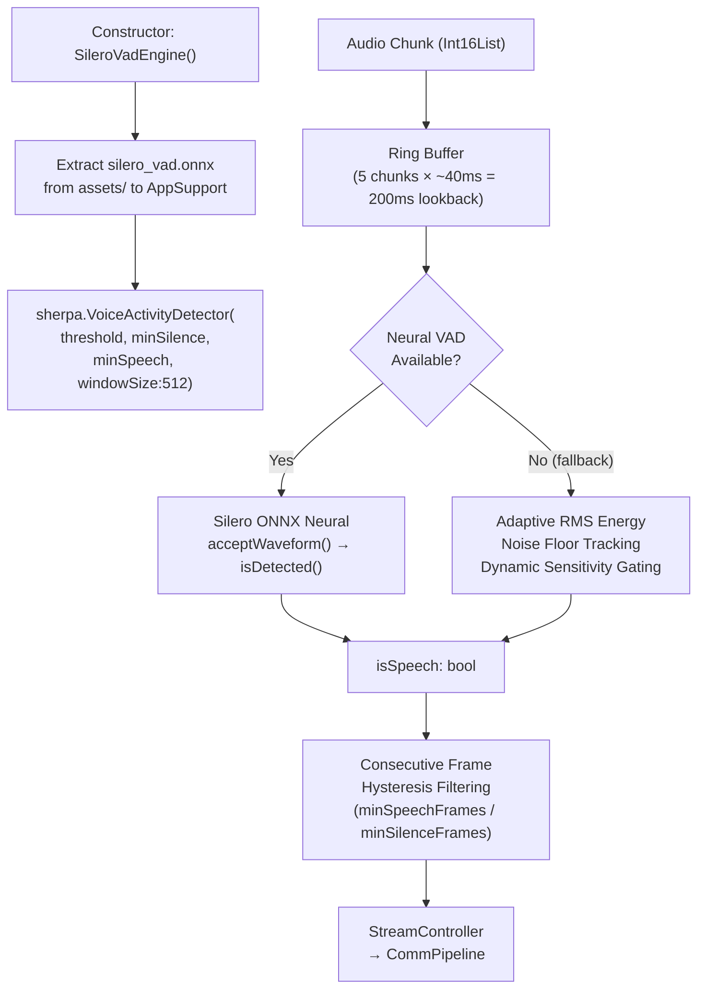
```mermaid
flowchart TD
    INIT["Constructor: SileroVadEngine()"]
    INIT --> EXTRACT["Extract silero_vad.onnx\nfrom assets/ to AppSupport"]
    EXTRACT --> LOAD["sherpa.VoiceActivityDetector(\nthreshold, minSilence,\nminSpeech, windowSize:512)"]
    
    AUDIO_IN["Audio Chunk (Int16List)"] --> RING["Ring Buffer\n(5 chunks × ~40ms = 200ms lookback)"]
    RING --> NEURAL{"Neural VAD\nAvailable?"}
    
    NEURAL -- "Yes" --> SILERO["Silero ONNX Neural\nacceptWaveform() → isDetected()"]
    NEURAL -- "No (fallback)" --> RMS["Adaptive RMS Energy\nNoise Floor Tracking\nDynamic Sensitivity Gating"]
    
    SILERO --> RESULT["isSpeech: bool"]
    RMS --> RESULT
    
    RESULT --> HYSTERESIS["Consecutive Frame\nHysteresis Filtering\n(minSpeechFrames / minSilenceFrames)"]
    HYSTERESIS --> EMIT_STATE["StreamController<bool>\n→ CommPipeline"]
```

### 4.4 Script Normalization Engine

> **File:** [script_normalization_engine.dart](file:///d:/My%20FIles/Softwares/iTantra/ITantra-dart/lib/speech/script_normalization_engine.dart)

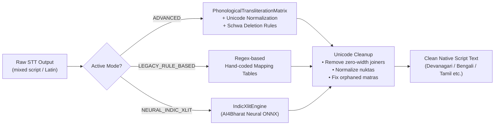
```mermaid
flowchart LR
    RAW["Raw STT Output\n(mixed script / Latin)"] --> MODE{"Active Mode?"}
    MODE -- "ADVANCED" --> ADV["PhonologicalTransliterationMatrix\n+ Unicode Normalization\n+ Schwa Deletion Rules"]
    MODE -- "LEGACY_RULE_BASED" --> LEG["Regex-based\nHand-coded Mapping Tables"]
    MODE -- "NEURAL_INDIC_XLIT" --> NEU["IndicXlitEngine\n(AI4Bharat Neural ONNX)"]
    
    ADV --> CLEAN["Unicode Cleanup\n• Remove zero-width joiners\n• Normalize nuktas\n• Fix orphaned matras"]
    LEG --> CLEAN
    NEU --> CLEAN
    CLEAN --> OUTPUT["Clean Native Script Text\n(Devanagari / Bengali / Tamil etc.)"]
```

### 4.5 Machine Translation (IndicTrans2)

> **File:** [indic_trans_engine.dart](file:///d:/My%20FIles/Softwares/iTantra/ITantra-dart/lib/speech/indic_trans_engine.dart)

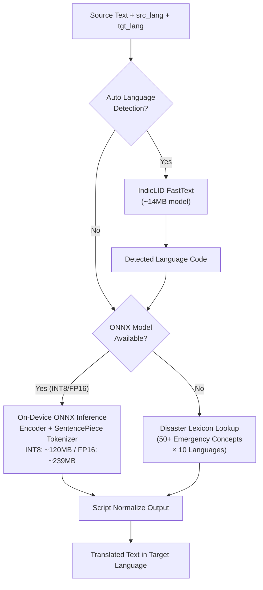
```mermaid
flowchart TD
    INPUT["Source Text + src_lang + tgt_lang"] --> LID{"Auto Language\nDetection?"}
    LID -- "Yes" --> INDIC_LID["IndicLID FastText\n(~14MB model)"]
    INDIC_LID --> DETECTED_LANG["Detected Language Code"]
    LID -- "No" --> TRANSLATE
    DETECTED_LANG --> TRANSLATE
    
    TRANSLATE{"ONNX Model\nAvailable?"}
    TRANSLATE -- "Yes (INT8/FP16)" --> ONNX_MT["On-Device ONNX Inference\nEncoder + SentencePiece Tokenizer\nINT8: ~120MB / FP16: ~239MB"]
    TRANSLATE -- "No" --> LEXICON["Disaster Lexicon Lookup\n(50+ Emergency Concepts\n× 10 Languages)"]
    
    ONNX_MT --> NORM_OUT["Script Normalize Output"]
    LEXICON --> NORM_OUT
    NORM_OUT --> RESULT["Translated Text in Target Language"]
```

### 4.6 Language Pack Manager

> **File:** [language_pack_manager.dart](file:///d:/My%20FIles/Softwares/iTantra/ITantra-dart/lib/speech/language_pack_manager.dart)

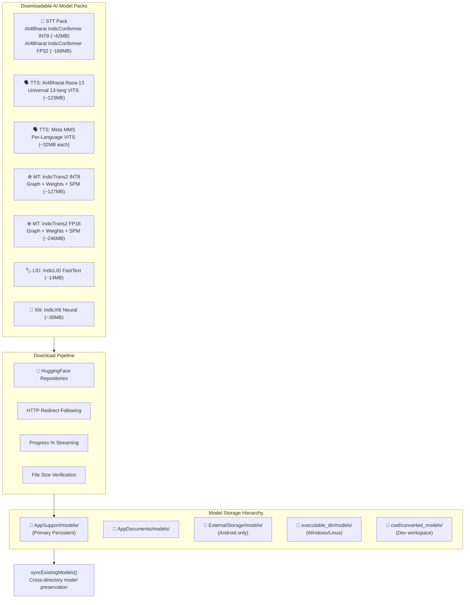
```mermaid
flowchart TD
    subgraph MODELS["Downloadable AI Model Packs"]
        STT_PACK["🧠 STT Pack\nAI4Bharat IndicConformer INT8 (~42MB)\nAI4Bharat IndicConformer FP32 (~168MB)"]
        TTS_RASA["🗣️ TTS: AI4Bharat Rasa-13\nUniversal 13-lang VITS (~123MB)"]
        TTS_MMS["🗣️ TTS: Meta MMS\nPer-Language VITS (~32MB each)"]
        MT_INT8["🌐 MT: IndicTrans2 INT8\nGraph + Weights + SPM (~127MB)"]
        MT_FP16["🌐 MT: IndicTrans2 FP16\nGraph + Weights + SPM (~246MB)"]
        LID_PACK["🏷️ LID: IndicLID FastText (~14MB)"]
        XLIT_PACK["🔡 Xlit: IndicXlit Neural (~35MB)"]
    end

    subgraph STORAGE["Model Storage Hierarchy"]
        PRIMARY["📁 AppSupport/models/\n(Primary Persistent)"]
        DOCS["📁 AppDocuments/models/"]
        EXT["📁 ExternalStorage/models/\n(Android only)"]
        EXE["📁 executable_dir/models/\n(Windows/Linux)"]
        CWD["📁 cwd/converted_models/\n(Dev workspace)"]
    end

    subgraph DOWNLOAD["Download Pipeline"]
        HF["🤗 HuggingFace Repositories"]
        REDIRECT["HTTP Redirect Following"]
        PROGRESS["Progress % Streaming"]
        VERIFY["File Size Verification"]
    end

    MODELS --> DOWNLOAD
    DOWNLOAD --> PRIMARY
    STORAGE --> SYNC["syncExistingModels()\nCross-directory model preservation"]
```

### Supported Languages (10 Official SIH 26173 Languages)

| Code | ISO-639-3 | English Name | Native Name | Script |
|------|-----------|-------------|-------------|--------|
| `hi` | `hin` | Hindi | हिंदी | Devanagari |
| `en` | `eng` | English | English | Latin |
| `gu` | `guj` | Gujarati | ગુજરાતી | Gujarati |
| `mr` | `mar` | Marathi | मराठी | Devanagari |
| `kn` | `kan` | Kannada | ಕನ್ನಡ | Kannada |
| `ml` | `mal` | Malayalam | മലയാളം | Malayalam |
| `ta` | `tam` | Tamil | தமிழ் | Tamil |
| `te` | `tel` | Telugu | తెలుగు | Telugu |
| `or` | `ory` | Odia | ଓଡ଼ିଆ | Odia |
| `bn` | `ben` | Bengali | বাংলা | Bengali |

---

## 5. Network & Transport Layer — Detailed Breakdown

### 5.1 TransceiverManager — TCP Mesh Core

> **File:** [transceiver_manager.dart](file:///d:/My%20FIles/Softwares/iTantra/ITantra-dart/lib/network/transceiver_manager.dart)

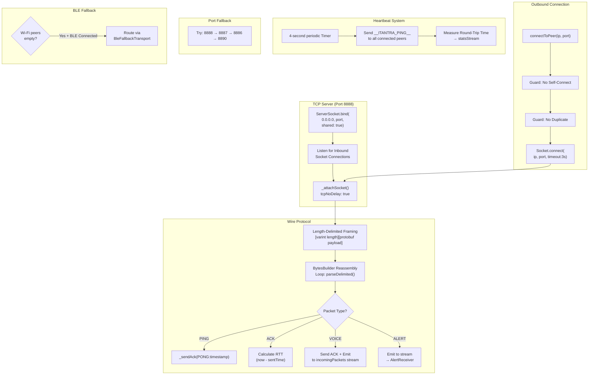
```mermaid
flowchart TD
    subgraph SERVER["TCP Server (Port 8888)"]
        BIND["ServerSocket.bind(\n0.0.0.0, port,\nshared: true)"]
        BIND --> LISTEN_CONN["Listen for Inbound\nSocket Connections"]
        LISTEN_CONN --> ATTACH["_attachSocket()\ntcpNoDelay: true"]
    end

    subgraph CLIENT["Outbound Connection"]
        CONNECT["connectToPeer(ip, port)"]
        CONNECT --> GUARD_SELF["Guard: No Self-Connect"]
        GUARD_SELF --> GUARD_DUP["Guard: No Duplicate"]
        GUARD_DUP --> SOCKET_CONN["Socket.connect(\nip, port, timeout:3s)"]
        SOCKET_CONN --> ATTACH
    end

    subgraph PROTOCOL["Wire Protocol"]
        ATTACH --> FRAME["Length-Delimited Framing\n[varint length][protobuf payload]"]
        FRAME --> REASSEMBLE["BytesBuilder Reassembly\nLoop: parseDelimited()"]
        REASSEMBLE --> DISPATCH{"Packet Type?"}
        DISPATCH -- "PING" --> PONG["_sendAck(PONG:timestamp)"]
        DISPATCH -- "ACK" --> RTT["Calculate RTT\n(now - sentTime)"]
        DISPATCH -- "VOICE" --> ACK_VOICE["Send ACK + Emit\nto incomingPackets stream"]
        DISPATCH -- "ALERT" --> ACK_ALERT["Emit to stream\n→ AlertReceiver"]
    end

    subgraph HEARTBEAT["Heartbeat System"]
        HB_TIMER["4-second periodic Timer"]
        HB_TIMER --> PING_ALL["Send __ITANTRA_PING__\nto all connected peers"]
        PING_ALL --> MEASURE_RTT["Measure Round-Trip Time\n→ statsStream"]
    end

    subgraph FALLBACK["Port Fallback"]
        PORTS["Try: 8888 → 8887 → 8886 → 8890"]
    end

    subgraph BLE_FB["BLE Fallback"]
        BLE_CHECK{"Wi-Fi peers\nempty?"}
        BLE_CHECK -- "Yes + BLE Connected" --> BLE_ROUTE["Route via\nBleFallbackTransport"]
    end
```

### 5.2 WiFi Mesh Manager — UDP Beacon Discovery

> **File:** [wifi_mesh_manager.dart](file:///d:/My%20FIles/Softwares/iTantra/ITantra-dart/lib/network/wifi_mesh_manager.dart)

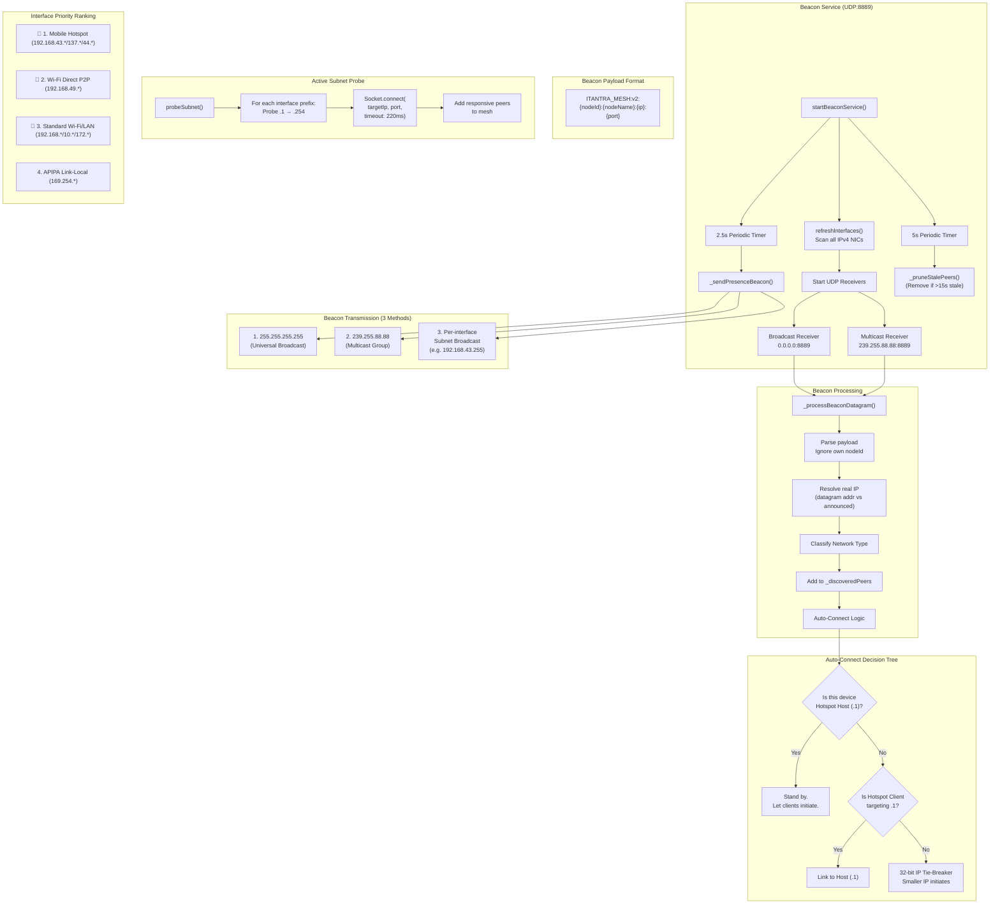
```mermaid
flowchart TD
    subgraph BEACON["Beacon Service (UDP:8889)"]
        START_BEACON["startBeaconService()"]
        START_BEACON --> REFRESH["refreshInterfaces()\nScan all IPv4 NICs"]
        REFRESH --> RECEIVERS["Start UDP Receivers"]
        RECEIVERS --> BCAST_RX["Broadcast Receiver\n0.0.0.0:8889"]
        RECEIVERS --> MCAST_RX["Multicast Receiver\n239.255.88.88:8889"]
        
        START_BEACON --> BEACON_TIMER["2.5s Periodic Timer"]
        BEACON_TIMER --> SEND_BEACON["_sendPresenceBeacon()"]
        
        START_BEACON --> PRUNE_TIMER["5s Periodic Timer"]
        PRUNE_TIMER --> PRUNE["_pruneStalePeers()\n(Remove if >15s stale)"]
    end

    subgraph BEACON_FORMAT["Beacon Payload Format"]
        FORMAT["ITANTRA_MESH:v2:{nodeId}:{nodeName}:{ip}:{port}"]
    end

    subgraph SEND["Beacon Transmission (3 Methods)"]
        SEND_BEACON --> UNI["1. 255.255.255.255\n(Universal Broadcast)"]
        SEND_BEACON --> MULTI["2. 239.255.88.88\n(Multicast Group)"]
        SEND_BEACON --> DIRECTED["3. Per-interface\nSubnet Broadcast\n(e.g. 192.168.43.255)"]
    end

    subgraph RECEIVE["Beacon Processing"]
        BCAST_RX --> PROCESS["_processBeaconDatagram()"]
        MCAST_RX --> PROCESS
        PROCESS --> VALIDATE["Parse payload\nIgnore own nodeId"]
        VALIDATE --> RESOLVE_IP["Resolve real IP\n(datagram addr vs announced)"]
        RESOLVE_IP --> CLASSIFY["Classify Network Type"]
        CLASSIFY --> ADD_PEER["Add to _discoveredPeers"]
        ADD_PEER --> AUTO_CONNECT["Auto-Connect Logic"]
    end

    subgraph AUTO_CONNECT_LOGIC["Auto-Connect Decision Tree"]
        AUTO_CONNECT --> HOTSPOT_HOST{"Is this device\nHotspot Host (.1)?"}
        HOTSPOT_HOST -- "Yes" --> WAIT["Stand by.\nLet clients initiate."]
        HOTSPOT_HOST -- "No" --> HOTSPOT_CLIENT{"Is Hotspot Client\ntargeting .1?"}
        HOTSPOT_CLIENT -- "Yes" --> LINK_HOST["Link to Host (.1)"]
        HOTSPOT_CLIENT -- "No" --> TIE_BREAK["32-bit IP Tie-Breaker\nSmaller IP initiates"]
    end

    subgraph SUBNET_PROBE["Active Subnet Probe"]
        PROBE["probeSubnet()"]
        PROBE --> SCAN_ALL["For each interface prefix:\nProbe .1 → .254"]
        SCAN_ALL --> TCP_PROBE["Socket.connect(\ntargetIp, port,\ntimeout: 220ms)"]
        TCP_PROBE --> FOUND["Add responsive peers\nto mesh"]
    end

    subgraph INTERFACE_RANKING["Interface Priority Ranking"]
        RANK1["🥇 1. Mobile Hotspot (192.168.43.*/137.*/44.*)"]
        RANK2["🥈 2. Wi-Fi Direct P2P (192.168.49.*)"]
        RANK3["🥉 3. Standard Wi-Fi/LAN (192.168.*/10.*/172.*)"]
        RANK4["4. APIPA Link-Local (169.254.*)"]
    end
```

### 5.3 WiFi Direct P2P Service (Android Native)

> **File:** [wifi_direct_p2p_service.dart](file:///d:/My%20FIles/Softwares/iTantra/ITantra-dart/lib/network/wifi_direct_p2p_service.dart)

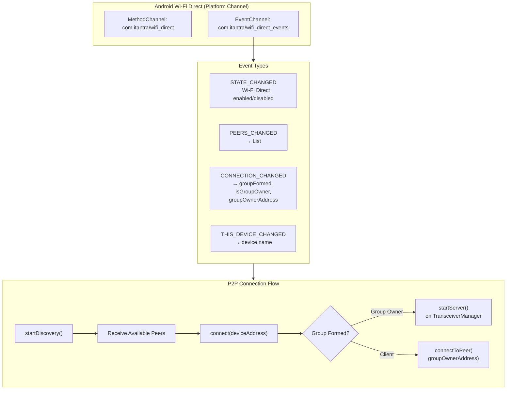
```mermaid
flowchart TD
    subgraph ANDROID_NATIVE["Android Wi-Fi Direct (Platform Channel)"]
        METHOD_CH["MethodChannel: com.itantra/wifi_direct"]
        EVENT_CH["EventChannel: com.itantra/wifi_direct_events"]
    end

    subgraph EVENTS["Event Types"]
        STATE["STATE_CHANGED\n→ Wi-Fi Direct enabled/disabled"]
        PEERS_CHANGED["PEERS_CHANGED\n→ List<WifiP2pPeer>"]
        CONN_CHANGED["CONNECTION_CHANGED\n→ groupFormed, isGroupOwner,\ngroupOwnerAddress"]
        DEVICE["THIS_DEVICE_CHANGED\n→ device name"]
    end

    subgraph P2P_FLOW["P2P Connection Flow"]
        DISCOVER["startDiscovery()"] --> FOUND_PEERS["Receive Available Peers"]
        FOUND_PEERS --> CONNECT["connect(deviceAddress)"]
        CONNECT --> GROUP{"Group Formed?"}
        GROUP -- "Group Owner" --> START_SERVER["startServer()\non TransceiverManager"]
        GROUP -- "Client" --> CONNECT_PEER["connectToPeer(\ngroupOwnerAddress)"]
    end

    EVENT_CH --> EVENTS
    EVENTS --> P2P_FLOW
```

### 5.4 BLE Fallback Transport

> **File:** [ble_fallback_transport.dart](file:///d:/My%20FIles/Softwares/iTantra/ITantra-dart/lib/network/ble_fallback_transport.dart)

```mermaid
flowchart TD
    subgraph BLE_GATT["BLE GATT Profile"]
        SERVICE["Service UUID: 0000FE60-..."]
        TX_CHAR["TX Characteristic: 0000FE61-..."]
        RX_CHAR["RX Characteristic: 0000FE62-..."]
    end

    subgraph FRAGMENTATION["Packet Fragmentation"]
        PACKET["TransceiverPacket\n(variable size)"]
        PACKET --> PROTO_BYTES["toProtoBytes()"]
        PROTO_BYTES --> FRAGMENT["Fragment into MTU chunks\nDefault: 180 bytes"]
        FRAGMENT --> HEADER["Per-fragment header:\n[packetId:2B][fragIdx:1B][totalFrags:1B]"]
        HEADER --> TRANSMIT["transmit with 15ms delay\nbetween fragments"]
    end

    subgraph REASSEMBLY["Packet Reassembly"]
        RX_CHUNK["receiveGattChunk(Uint8List)"]
        RX_CHUNK --> PARSE_HEADER["Parse packetId,\nfragmentIndex, totalFragments"]
        PARSE_HEADER --> BUFFER["_reassemblyBuffers\n(packetId → fragments map)"]
        BUFFER --> COMPLETE{"All fragments\nreceived?"}
        COMPLETE -- "Yes" --> REBUILD["BytesBuilder reassemble\n→ fromProtoBytes()"]
        COMPLETE -- "No" --> WAIT_MORE["Wait for more chunks"]
        REBUILD --> EMIT["Emit TransceiverPacket\nto incomingPackets stream"]
    end

    subgraph CLEANUP["Stale Buffer Cleanup"]
        TIMER_CLEAN["10-second timeout\nfor incomplete packets"]
    end
```

### 5.5 TransceiverPacket — Wire Protocol

> **File:** [transceiver_packet.dart](file:///d:/My%20FIles/Softwares/iTantra/ITantra-dart/lib/proto/transceiver_packet.dart)

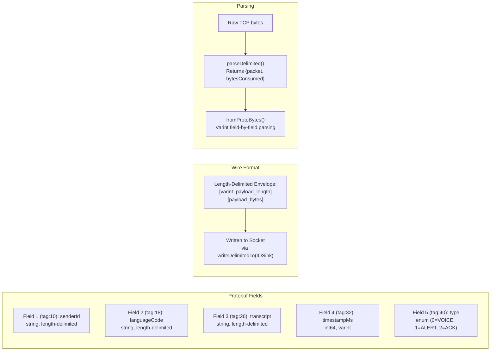
```mermaid
flowchart LR
    subgraph PROTO_FIELDS["Protobuf Fields"]
        F1["Field 1 (tag:10): senderId\nstring, length-delimited"]
        F2["Field 2 (tag:18): languageCode\nstring, length-delimited"]
        F3["Field 3 (tag:26): transcript\nstring, length-delimited"]
        F4["Field 4 (tag:32): timestampMs\nint64, varint"]
        F5["Field 5 (tag:40): type\nenum (0=VOICE, 1=ALERT, 2=ACK)"]
    end

    subgraph WIRE["Wire Format"]
        DELIMITED["Length-Delimited Envelope:\n[varint: payload_length][payload_bytes]"]
        DELIMITED --> SOCKET["Written to Socket\nvia writeDelimitedTo(IOSink)"]
    end

    subgraph PARSE["Parsing"]
        RAW_BYTES["Raw TCP bytes"]
        RAW_BYTES --> PARSE_DELIM["parseDelimited()\nReturns {packet, bytesConsumed}"]
        PARSE_DELIM --> FROM_PROTO["fromProtoBytes()\nVarint field-by-field parsing"]
    end
```

---

## 6. Controller Layer — State Management

### 6.1 TransceiverController — Central Orchestrator

> **File:** [transceiver_controller.dart](file:///d:/My%20FIles/Softwares/iTantra/ITantra-dart/lib/controllers/transceiver_controller.dart)

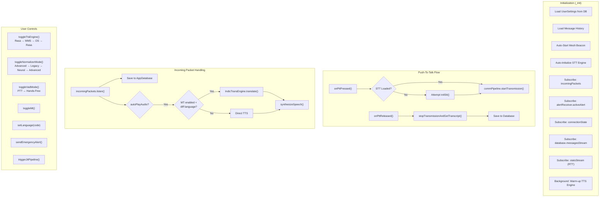
```mermaid
flowchart TD
    subgraph INIT["Initialization (_init)"]
        LOAD_SETTINGS["Load UserSettings from DB"]
        LOAD_MSGS["Load Message History"]
        AUTO_BEACON["Auto-Start Mesh Beacon"]
        AUTO_STT["Auto-Initialize STT Engine"]
        SUB_PACKETS["Subscribe: incomingPackets"]
        SUB_ALERTS["Subscribe: alertReceiver.activeAlert"]
        SUB_STATUS["Subscribe: connectionState"]
        SUB_DB["Subscribe: database.messagesStream"]
        SUB_STATS["Subscribe: statsStream (RTT)"]
        WARMUP_TTS["Background: Warm-up TTS Engine"]
    end

    subgraph PTT["Push-To-Talk Flow"]
        PRESS["onPttPressed()"]
        PRESS --> STT_GUARD{"STT Loaded?"}
        STT_GUARD -- "No" --> INIT_STT["Attempt initStt()"]
        STT_GUARD -- "Yes" --> START_TX["commPipeline.startTransmission()"]
        INIT_STT --> START_TX
        
        RELEASE["onPttReleased()"]
        RELEASE --> STOP_TX["stopTransmissionAndGetTranscript()"]
        STOP_TX --> SAVE_MSG["Save to Database"]
    end

    subgraph RECEIVE["Incoming Packet Handling"]
        PACKET_RX["incomingPackets.listen()"]
        PACKET_RX --> SAVE_DB["Save to AppDatabase"]
        PACKET_RX --> AUTO_PLAY{"autoPlayAudio?"}
        AUTO_PLAY -- "Yes" --> MT_CHECK2{"MT enabled +\ndiff language?"}
        MT_CHECK2 -- "Yes" --> TRANSLATE["IndicTransEngine.translate()"]
        MT_CHECK2 -- "No" --> DIRECT_TTS["Direct TTS"]
        TRANSLATE --> SPEAK["synthesizeSpeech()"]
        DIRECT_TTS --> SPEAK
    end

    subgraph CONTROLS["User Controls"]
        TOGGLE_TTS["toggleTtsEngine()\nRasa → MMS → OS → Rasa"]
        TOGGLE_NORM["toggleNormalizerMode()\nAdvanced → Legacy → Neural → Advanced"]
        TOGGLE_VAD_MODE["toggleVadMode()\nPTT ↔ Hands-Free"]
        TOGGLE_MT2["toggleMt()"]
        SET_LANG["setLanguage(code)"]
        SEND_ALERT["sendEmergencyAlert()"]
        JIT["triggerJitPipeline()"]
    end
```

### 6.2 Other Controllers

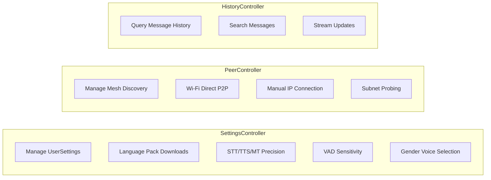
```mermaid
flowchart LR
    subgraph SC["SettingsController"]
        SC1["Manage UserSettings"]
        SC2["Language Pack Downloads"]
        SC3["STT/TTS/MT Precision"]
        SC4["VAD Sensitivity"]
        SC5["Gender Voice Selection"]
    end

    subgraph PC["PeerController"]
        PC1["Manage Mesh Discovery"]
        PC2["Wi-Fi Direct P2P"]
        PC3["Manual IP Connection"]
        PC4["Subnet Probing"]
    end

    subgraph HC["HistoryController"]
        HC1["Query Message History"]
        HC2["Search Messages"]
        HC3["Stream Updates"]
    end
```

---

## 7. Alert Subsystem

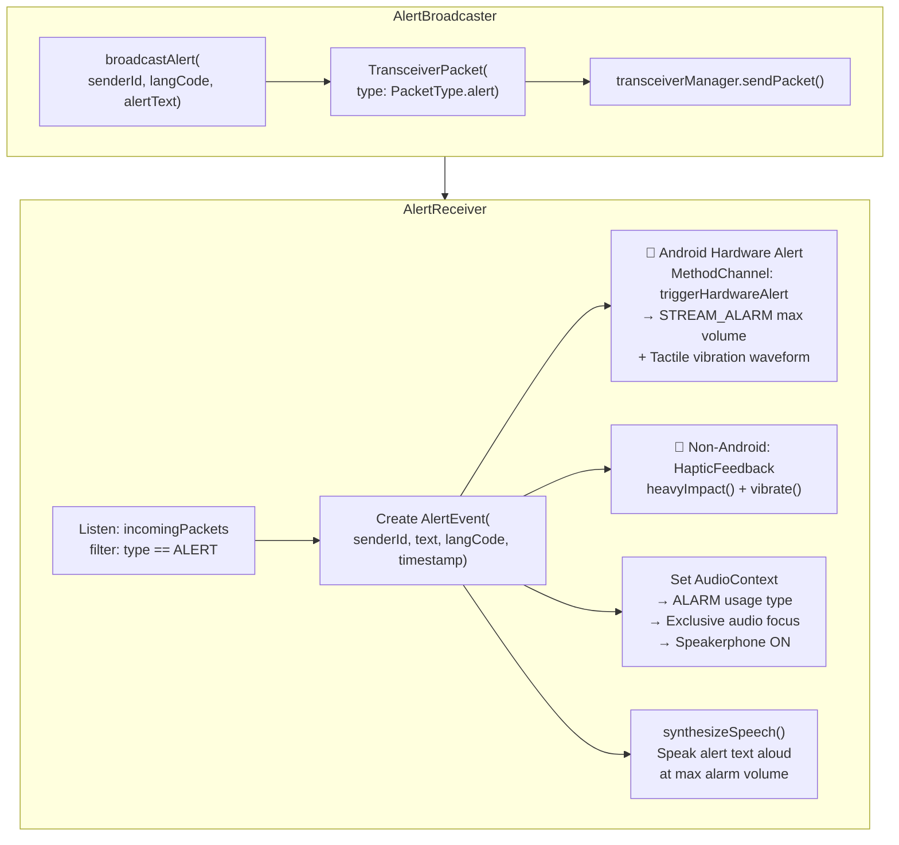
```mermaid
flowchart TD
    subgraph BROADCAST["AlertBroadcaster"]
        SEND_ALERT2["broadcastAlert(\nsenderId, langCode, alertText)"]
        SEND_ALERT2 --> CREATE_PKT["TransceiverPacket(\ntype: PacketType.alert)"]
        CREATE_PKT --> SEND_PKT["transceiverManager.sendPacket()"]
    end

    subgraph RECEIVE_ALERT["AlertReceiver"]
        LISTEN2["Listen: incomingPackets\nfilter: type == ALERT"]
        LISTEN2 --> ALERT_EVENT["Create AlertEvent(\nsenderId, text, langCode, timestamp)"]
        ALERT_EVENT --> HARDWARE["🔔 Android Hardware Alert\nMethodChannel: triggerHardwareAlert\n→ STREAM_ALARM max volume\n+ Tactile vibration waveform"]
        ALERT_EVENT --> NON_ANDROID["📳 Non-Android: HapticFeedback\nheavyImpact() + vibrate()"]
        ALERT_EVENT --> AUDIO_CTX["Set AudioContext\n→ ALARM usage type\n→ Exclusive audio focus\n→ Speakerphone ON"]
        ALERT_EVENT --> TTS_SPEAK["synthesizeSpeech()\nSpeak alert text aloud\nat max alarm volume"]
    end

    BROADCAST --> RECEIVE_ALERT
```

---

## 8. Data & Persistence Layer

> **File:** [app_database.dart](file:///d:/My%20FIles/Softwares/iTantra/ITantra-dart/lib/data/app_database.dart)

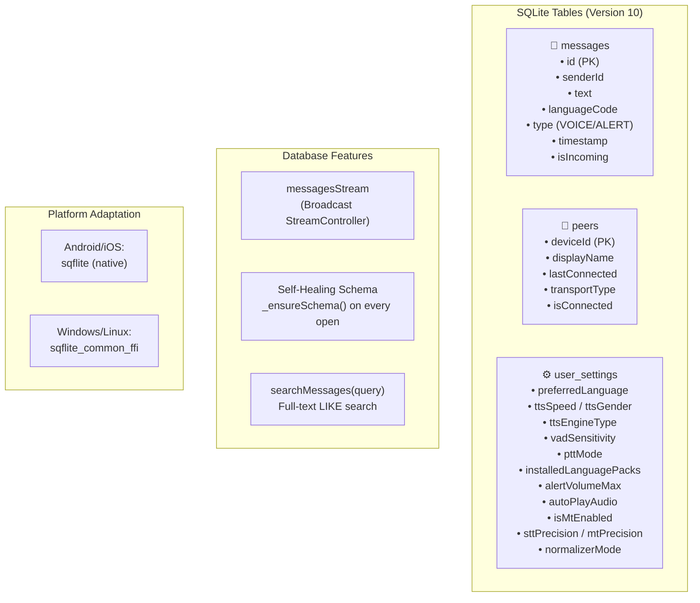
```mermaid
flowchart TD
    subgraph TABLES["SQLite Tables (Version 10)"]
        MESSAGES["📨 messages\n• id (PK)\n• senderId\n• text\n• languageCode\n• type (VOICE/ALERT)\n• timestamp\n• isIncoming"]
        
        PEERS2["👥 peers\n• deviceId (PK)\n• displayName\n• lastConnected\n• transportType\n• isConnected"]
        
        SETTINGS["⚙️ user_settings\n• preferredLanguage\n• ttsSpeed / ttsGender\n• ttsEngineType\n• vadSensitivity\n• pttMode\n• installedLanguagePacks\n• alertVolumeMax\n• autoPlayAudio\n• isMtEnabled\n• sttPrecision / mtPrecision\n• normalizerMode"]
    end

    subgraph FEATURES["Database Features"]
        STREAM["messagesStream\n(Broadcast StreamController)"]
        SCHEMA_HEAL["Self-Healing Schema\n_ensureSchema() on every open"]
        SEARCH["searchMessages(query)\nFull-text LIKE search"]
    end

    subgraph PLATFORM["Platform Adaptation"]
        ANDROID_DB["Android/iOS:\nsqflite (native)"]
        DESKTOP_DB["Windows/Linux:\nsqflite_common_ffi"]
    end
```

---

## 9. UI Presentation Layer

```mermaid
flowchart TD
    subgraph SCREENS["Application Screens"]
        SPLASH2["🎬 SplashScreen\n(Entry → HomeScreen)"]
        HOME2["🏠 HomeScreen\n(Navigation Hub)"]
        TRANS2["📻 TransceiverScreen\n(Walkie-Talkie UI\nPTT / VAD Mode\nMessage Bubbles)"]
        PEER2["🔍 PeerDiscoveryScreen\n(Mesh Peers\nWi-Fi Direct\nManual IP Connect)"]
        SETTINGS2["⚙️ SettingsScreen\n(Language Packs\nVoice Config\nModel Management)"]
        ALERT2["🚨 AlertScreen\n(Emergency Alerts\nDistress Dispatch)"]
        HISTORY2["📜 HistoryScreen\n(Message Log\nSearch)"]
        LANG2["🌐 LanguageSetupScreen\n(Initial Language\nSelection)"]
        DIAG2["🔧 DevDiagnosticsScreen\n(Network Stats\nEngine Status\nDebug Info)"]
        MODEL2["🧪 ModelTestLabScreen\n(STT/TTS Testing\nBenchmarks)"]
    end

    SPLASH2 --> HOME2
    HOME2 --> TRANS2
    HOME2 --> PEER2
    HOME2 --> SETTINGS2
    HOME2 --> ALERT2
    HOME2 --> HISTORY2
    HOME2 --> LANG2
    HOME2 --> DIAG2
    HOME2 --> MODEL2
```

---

## 10. End-to-End Data Flow — Complete Pipeline

This diagram shows the **full journey of a voice message** from one device to another:

```mermaid
sequenceDiagram
    participant U1 as 👤 User A (Sender)
    participant MIC as 🎙️ Microphone
    participant VAD as 🧠 SileroVAD
    participant STT as 🧠 IndicConformer STT
    participant NORM as 📝 ScriptNormalizer
    participant PKT as 📦 TransceiverPacket
    participant TCP as 📡 TCP:8888
    participant NET as 🌐 Wi-Fi Mesh
    participant TCP2 as 📡 TCP:8888
    participant DB as 💾 SQLite DB
    participant MT as 🌐 IndicTrans2 MT
    participant TTS as 🗣️ VITS TTS Engine
    participant SPK as 🔊 Speaker
    participant U2 as 👤 User B (Receiver)

    U1->>MIC: Press PTT Button
    MIC->>VAD: Stream PCM Audio (16kHz)
    VAD->>VAD: Detect Speech Activity
    VAD-->>MIC: Lookback Buffer (200ms)
    MIC->>STT: Feed Active Speech Frames
    STT->>STT: IndicConformer CTC Decode
    
    U1->>MIC: Release PTT Button
    STT->>NORM: Raw Transcript
    NORM->>NORM: Unicode Normalize + Transliterate
    NORM->>PKT: Cleaned Native Script Text
    PKT->>PKT: Protobuf Serialize
    PKT->>TCP: writeDelimitedTo()
    TCP->>NET: Length-Delimited Binary
    NET->>TCP2: P2P TCP Transfer
    TCP2->>PKT: parseDelimited()
    PKT->>DB: insertMessage()
    
    PKT->>MT: Check if MT needed
    alt Languages differ + MT enabled
        MT->>MT: IndicTrans2 Translate
        MT->>TTS: Translated Text
    else Same language or MT disabled
        PKT->>TTS: Original Text
    end
    
    TTS->>TTS: VITS Neural Synthesis
    TTS->>TTS: Gender Voice Routing
    TTS->>TTS: Build WAV + Fade-out
    TTS->>SPK: AudioPlayer.play()
    SPK->>U2: 🔊 Hear Spoken Message
```

---

## 11. Technology Stack Summary

| Layer | Technology | Purpose |
|-------|-----------|---------|
| **Framework** | Flutter 3.11+ / Dart | Cross-platform UI + Logic |
| **State Management** | Provider (ChangeNotifier) | Reactive UI binding to controllers |
| **STT Engine** | sherpa_onnx (AI4Bharat IndicConformer INT8/FP32) | Dedicated on-device Indian language speech recognition |
| **TTS Engine** | sherpa_onnx VITS (Rasa-13 / Meta MMS) | On-device neural speech synthesis |
| **VAD Engine** | Silero VAD ONNX + Adaptive RMS | Voice activity detection |
| **Translation** | IndicTrans2 ONNX (INT8/FP16) | On-device machine translation |
| **Script Processing** | PhonologicalTransliterationMatrix | Unicode-aware Indic transliteration |
| **Language ID** | IndicLID FastText | Automatic language detection |
| **Transport (Primary)** | TCP Sockets (port 8888) | Reliable peer-to-peer data |
| **Discovery** | UDP Broadcast + Multicast (port 8889) | Zero-config mesh discovery |
| **Transport (P2P)** | Wi-Fi Direct (Android MethodChannel) | Infrastructure-free P2P |
| **Transport (Fallback)** | BLE GATT | Ultra-low-power backup link |
| **Wire Protocol** | Custom Protobuf (hand-coded) | Compact binary serialization |
| **Database** | SQLite (sqflite + sqflite_common_ffi) | Persistent storage |
| **Audio I/O** | record + audioplayers | Mic capture + WAV playback |
| **Audio Processing** | Manual PCM/WAV (Dart) | 16-bit PCM, RIFF WAV builder |
| **ONNX Runtime** | sherpa_onnx native bindings (C/C++ FFI) | Neural model inference |

---

## 12. File-to-Module Mapping

```mermaid
mindmap
    root["iTantra-dart/lib/"]
        main["main.dart\n(App Bootstrap + DI)"]
        controllers
            tc["transceiver_controller.dart\n(Central Orchestrator)"]
            sc["settings_controller.dart\n(Preferences + Downloads)"]
            pc["peer_controller.dart\n(Mesh + P2P Discovery)"]
            hc["history_controller.dart\n(Message History)"]
        speech
            cp["comm_pipeline.dart\n(Voice Pipeline Core)"]
            se["sherpa_onnx_speech_engine.dart\n(STT + TTS)"]
            vad["silero_vad_engine.dart\n(Voice Activity Detection)"]
            ar["audio_recorder_service.dart\n(Microphone)"]
            sne["script_normalization_engine.dart\n(Indic Script Processing)"]
            ite["indic_trans_engine.dart\n(Machine Translation)"]
            lpm["language_pack_manager.dart\n(Model Downloads)"]
            ptm["phonological_transliteration_matrix.dart\n(Transliteration Tables)"]
            lid["indiclid_fasttext_engine.dart\n(Language ID)"]
            xlit["indic_xlit_engine.dart\n(Neural Transliteration)"]
            tts_os["os_native_tts_service.dart\n(OS Native Fallback)"]
        network
            tm["transceiver_manager.dart\n(TCP Server/Client)"]
            wmm["wifi_mesh_manager.dart\n(UDP Beacon Discovery)"]
            p2p["wifi_direct_p2p_service.dart\n(Android P2P)"]
            ble["ble_fallback_transport.dart\n(BLE GATT)"]
        proto
            pkt["transceiver_packet.dart\n(Protobuf Wire Format)"]
        alerts
            ab["alert_broadcaster.dart\n(Send Alerts)"]
            arec["alert_receiver.dart\n(Receive + Sound Alarm)"]
        data
            db["app_database.dart\n(SQLite)"]
            entities
                me["message_entity.dart"]
                pe["peer_device_entity.dart"]
                use["user_settings_entity.dart"]
        ui
            theme["app_theme.dart"]
            widgets["message_bubble.dart"]
            screens
                splash["splash_screen.dart"]
                home["home_screen.dart"]
                transceiver["transceiver_screen.dart"]
                peer["peer_discovery_screen.dart"]
                settings["settings_screen.dart"]
                alert["alert_screen.dart"]
                history["history_screen.dart"]
                language["language_setup_screen.dart"]
                diag["dev_diagnostics_screen.dart"]
                model_lab["model_test_lab_screen.dart"]
```

---

## 13. Dependency Graph

```mermaid
graph BT
    subgraph FOUNDATION["Foundation Layer"]
        DB2["AppDatabase"]
        PROTO2["TransceiverPacket"]
        ENTITIES["Entities\n(Message, Peer, Settings)"]
    end

    subgraph ENGINES["Engine Layer"]
        AR2["AudioRecorderService"]
        VAD2["SileroVadEngine"]
        SE2["SherpaOnnxSpeechEngine"]
        SNE2["ScriptNormalizationEngine"]
        ITE2["IndicTransEngine"]
        LPM2["LanguagePackManager"]
        LID2["IndicLID FastText"]
        XLIT2["IndicXlitEngine"]
        PTM2["PhonologicalTransliterationMatrix"]
    end

    subgraph TRANSPORT["Transport Layer"]
        TM2["TransceiverManager"]
        WMM2["WifiMeshManager"]
        P2P2["WifiDirectP2pService"]
        BLE2["BleFallbackTransport"]
    end

    subgraph PIPELINE["Pipeline Layer"]
        CP2["CommPipeline"]
        AB2["AlertBroadcaster"]
        AREC2["AlertReceiver"]
    end

    subgraph CONTROLLERS2["Controller Layer"]
        TC2["TransceiverController"]
        SC2["SettingsController"]
        PC2["PeerController"]
        HC2["HistoryController"]
    end

    SE2 --> LPM2
    SE2 --> SNE2
    SNE2 --> XLIT2
    SNE2 --> PTM2
    ITE2 --> LID2
    ITE2 --> SNE2
    
    TM2 --> BLE2
    TM2 --> PROTO2
    WMM2 --> TM2
    P2P2 --> TM2
    
    CP2 --> AR2
    CP2 --> VAD2
    CP2 --> SE2
    CP2 --> TM2
    CP2 --> SNE2
    
    AB2 --> TM2
    AREC2 --> TM2
    AREC2 --> SE2
    AREC2 --> DB2
    
    TC2 --> CP2
    TC2 --> TM2
    TC2 --> WMM2
    TC2 --> AB2
    TC2 --> AREC2
    TC2 --> SE2
    TC2 --> DB2
    TC2 --> ITE2
    
    SC2 --> DB2
    SC2 --> LPM2
    SC2 --> SE2
    
    PC2 --> WMM2
    PC2 --> TM2
    PC2 --> P2P2
    
    HC2 --> DB2
```

---

> [!IMPORTANT]
> This document covers every source file, every pipeline stage, and every working component in the iTantra project. All diagrams are generated from actual code analysis — no placeholders or assumptions.
