# System Architecture: Comm, Crypto & Transport Pipeline

```mermaid
flowchart LR
    %% Global Styling
    classDef default fill:#111827,stroke:#374151,stroke-width:1px,color:#E5E7EB;
    classDef decision fill:#1F2937,stroke:#60A5FA,stroke-width:1.5px,color:#93C5FD;
    classDef vad fill:#1e1b4b,stroke:#a855f7,stroke-width:1.5px,color:#e9d5ff;
    classDef crypto fill:#3b0764,stroke:#c084fc,stroke-width:1.5px,color:#f3e8ff;
    classDef wifi fill:#064E3B,stroke:#10B981,stroke-width:1.5px,color:#A7F3D0;
    classDef ble fill:#1E293B,stroke:#818CF8,stroke-width:1.5px,color:#C7D2FE;
    classDef emergency fill:#7F1D1D,stroke:#EF4444,stroke-width:1.5px,color:#FCA5A5;
    classDef sink fill:#0f172a,stroke:#38BDF8,stroke-width:1.5px,color:#BAE6FD;

    %% -----------------------------------------------------------
    %% STAGE 1: INGRESS
    %% -----------------------------------------------------------
    subgraph STAGE1 ["1. Ingress & Gating"]
        direction TB
        MIC["16kHz PCM Stream\n(AudioRecord)"] --> VAD{"VAD Gate\n(Silero ONNX)"}:::vad
        VAD -- "<0.5" --> DROP["Drop / Sleep"]
        VAD -- ">=0.5" --> LANG["Lang Select\n(hi/ta/te/mr/en)"]
        
        SOS["🚨 SOS Trigger\n(Distress Button)"]:::emergency --> SOS_PRESET["Preset Telemetry\n(Priority: 0xFF)"]:::emergency
    end

    %% -----------------------------------------------------------
    %% STAGE 2: PROCESSING & TRANSLATION
    %% -----------------------------------------------------------
    subgraph STAGE2 ["2. STT, MT & Serialization"]
        direction TB
        LANG --> STT["IndicConformer STT\n(Edge ONNX)"]
        STT --> TXT["Text Transcript"]
        TXT --> MT_CHECK{"Translate\nToggle?"}:::decision
        
        MT_CHECK -- "Enabled" --> MT["IndicTrans2 Engine\n(Target Lang MT)"]
        MT_CHECK -- "Bypass" --> PROTO["Protobuf Serializer\n(TransceiverPacket)"]
        MT --> PROTO
        SOS_PRESET --> PROTO
    end

    %% -----------------------------------------------------------
    %% STAGE 3: SECURITY & TRANSPORT ARBITRATION
    %% -----------------------------------------------------------
    subgraph STAGE3 ["3. Crypto & Dual-PHY Routing"]
        direction TB
        PROTO --> CRYPTO["Crypto Layer\nAES-256-GCM / ChaCha20\n(Ciphertext + Auth Tag)"]:::crypto
        CRYPTO --> PHY_ROUTE{"Wi-Fi P2P\nAvailable?"}:::decision
        
        PHY_ROUTE -- "Active (Primary)" --> WIFI["📡 Wi-Fi Direct Mesh\nUDP Multicast (Port 8889)"]:::wifi
        PHY_ROUTE -- "Loss (Fallback)" --> BLE["📶 BLE GATT Radio\n180B MTU Chunking"]:::ble
    end

    %% -----------------------------------------------------------
    %% STAGE 4: RECEIVER DECRYPTION & EGRESS
    %% -----------------------------------------------------------
    subgraph STAGE4 ["4. Ingress, Decrypt & Audio Sink"]
        direction TB
        WIFI --> REASSEMBLE["Packet Reassembly\n& Ingress Queue"]
        BLE --> REASSEMBLE
        REASSEMBLE --> DECRYPT["Payload Decrypt\n& Tag Verification"]:::crypto
        DECRYPT --> DEFRAME["Protobuf De-frame"]
        DEFRAME --> PRIO_CHECK{"Priority ==\n0xFF (SOS)?"}:::decision

        PRIO_CHECK -- "Normal Voice" --> TTS["Target TTS Engine\nSTREAM_MUSIC (Normal Vol)"]:::sink
        PRIO_CHECK -- "EMERGENCY" --> ALARM["🚨 DND Override Siren\nSTREAM_ALARM (100% Vol)"]:::emergency
    end

    %% Inter-stage connections
    STAGE1 ==> STAGE2
    STAGE2 ==> STAGE3
    STAGE3 ==> STAGE4
```

---

### Technical Specification Matrix

| Stage | Module | Specs & Protocols | Description |
| :--- | :--- | :--- | :--- |
| **VAD Gate** | `SileroVadEngine` | ONNX Runtime (30ms frames @ 16kHz) | Threshold gating ($\ge 0.5$ passes speech; $< 0.5$ dropped to conserve energy). |
| **Lang Select** | Language Profile | ISO 639-1 (`hi`, `ta`, `te`, `mr`, `en`...) | Directs acoustic STT tokenizer & vocabulary lookup on-device. |
| **Edge STT** | `SherpaOnnxSpeechEngine` | Quantized IndicConformer INT8 | Real-time speech-to-text inference with zero cloud dependency. |
| **Translation** | `IndicTransEngine` (Optional) | IndicTrans2 / Tactical Lexicon | Translates source script to peer target dialect; bypassed if disabled. |
| **Wire Protocol** | `TransceiverPacket` | Google Protocol Buffers (Binary wire) | Compact binary serialization of headers, sender ID, language, and payload. |
| **Encryption** | Crypto Subsystem | AES-256-GCM / Authenticated Cipher | Symmetric wireframe encryption with MAC integrity tags over the air. |
| **Primary PHY** | `WifiMeshManager` | Wi-Fi Direct P2P / UDP Port `8889` | Full-speed peer mesh multicast with sub-100ms latency. |
| **Fallback PHY**| `BleFallbackTransport`| Bluetooth LE GATT (180B MTU) | Slices packets into sequenced frames for low-power offline failover. |
| **Receiver Egress**| `AlertReceiver` / AudioSink | Android `AudioTrack` (`STREAM_ALARM` vs `MUSIC`)| Normal TTS playback or DND-override emergency siren at 100% gain. |
